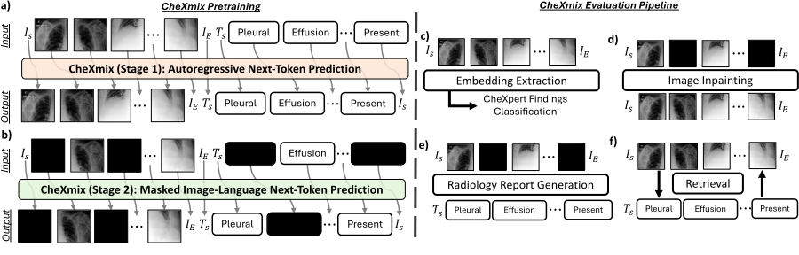

# CheXmix: Unified Generative Pretraining for Vision Language Models in Medical Imaging

[](https://arxiv.org/abs/2604.22989)    [](https://huggingface.co/stanfordmimi/CheXmix)

*CheXmix is an early-fusion multi-modal chest x-ray vision-language model capable of fine-grained discriminative and generative tasks.* (CVPR Findings 2026).



## ⚡️ Installation

For an editable installation, use the following commands to clone and install this repository.

```bash
conda create --name chexmix python==3.10
conda activate chexmix

git clone https://github.com/StanfordMIMI/CheXmix
cd chexmix
pip install -e .
```

## 🚀 Inference with CheXmix

To create a CheXmix model with generative capabilities enabled by default, use the following:

```python
from chexmix import CheXmix

model = CheXmix()
```

To instantiate a model that outputs image embeddings layer by layer, use:

```python
from chexmix import CheXmix

model = CheXmix(ImageEmbeddings=True)
```

To instantiate a model for report generation, use:

```python
from chexmix import CheXmix

model = CheXmix(ReportGeneration=True)
```

#### For inference on a demo chest x-ray, please check out the [general demo](documentation/demo.py).

#### For additional information, please read the [inference documentation](documentation/inference.md).

## 📎 Citation

If you find this repository useful for your work, please cite the cite the paper:

```bibtex
@inproceedings{kumar2026chexmix,
  author    = {Kumar, Ashwin and Holland, Robbie and Barrett, Corey and Kim, Jangwon and Varma, Maya and Chen, Zhihong and Gao, Yunhe and Zaharchuk, Greg and Taghavi, Tara and Kenthapadi, Krishnaram and Chaudhari, Akshay},
  title     = {CheXmix: Unified Generative Pretraining for Vision Language Models in Medical Imaging},
  booktitle = {Proceedings of the IEEE/CVF Conference on Computer Vision and Pattern Recognition (CVPR) Findings},
  pages     = {9466--9476},
  year      = {2026},
  note      = {arXiv preprint arXiv:2604.22989}
}
```
